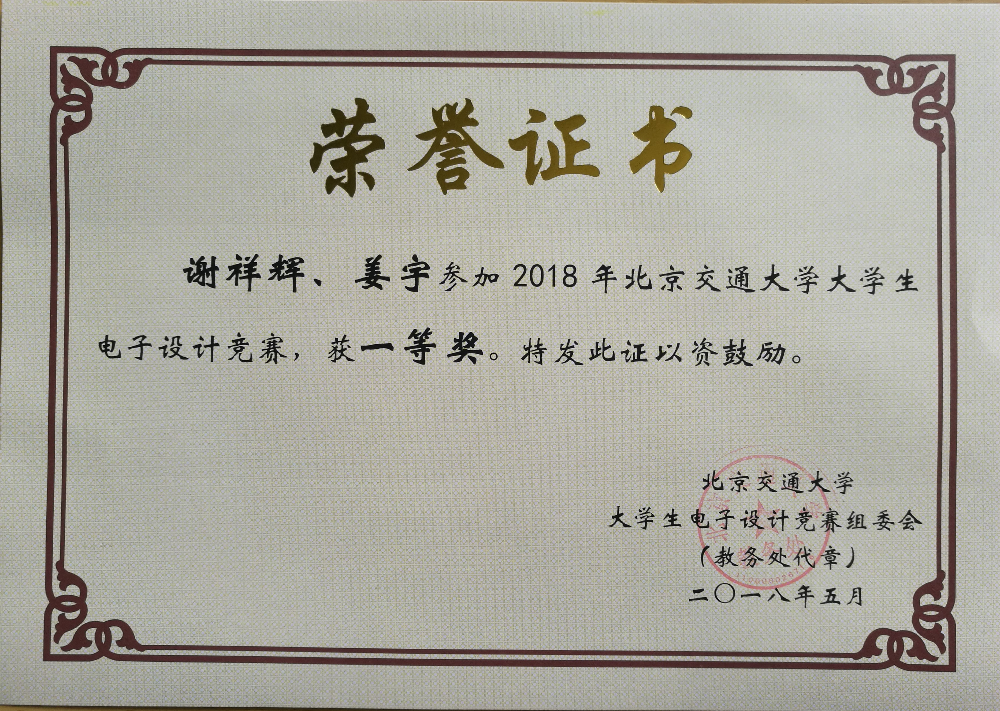
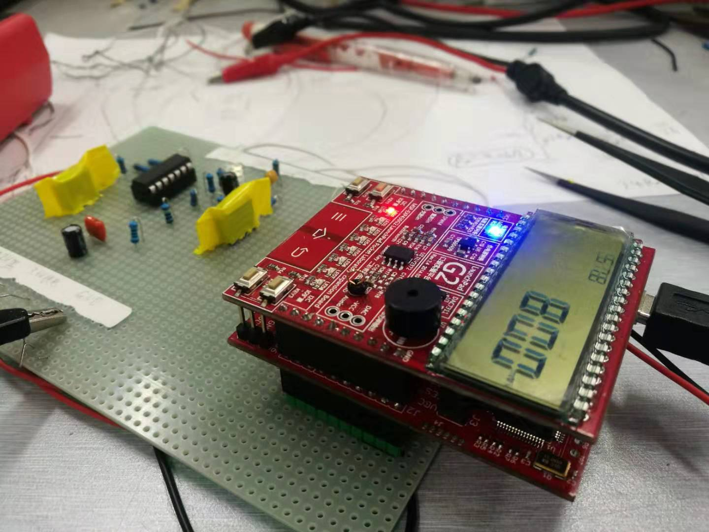
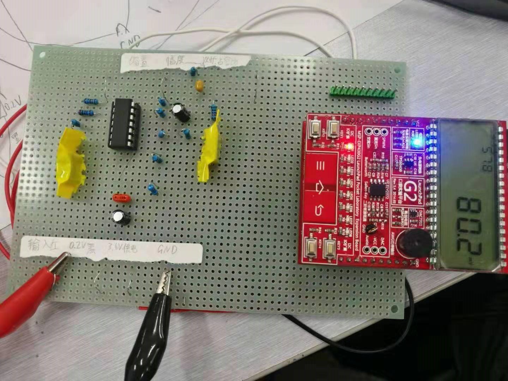

# multimeter-MSP430
The source code of a MSP430-based digital multimeter in Electronic design contest. 

## Introduction
The competition task is on file 2018年北京交通大学大学生电子设计竞赛赛题.pdf. We were asked to use MSP430G2553, extension board and necessary signal processing circuit to make a digital multimeter to measure AC amplitude, frequency, DC offset and duty. 

## Our result
During the one-day competition, our team had implemented measurement of AC amplitude(full range as required: 10-160mVpp), DC offset(part of the required range: 50-100mV) and frequency(the extended range: 10Hz-10kHz). Our score ranked the third of all 50 teams(3/50) and thus won the first prize. 

## Demo
Following is two pictures of our multimeter. 

